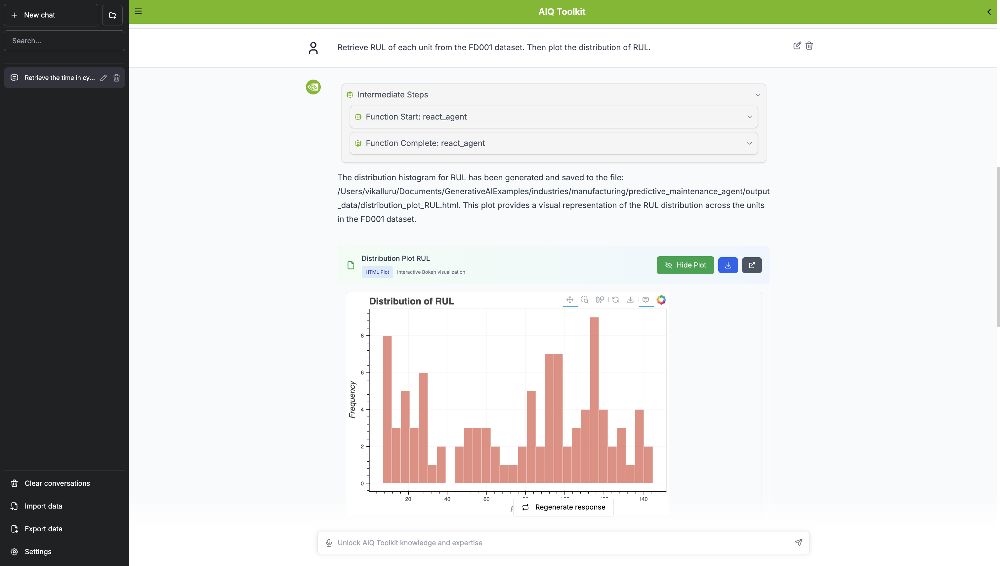

# Predictive Maintenance Agent

A comprehensive AI-powered predictive maintenance system built with NVIDIA AIQ Toolkit for turbofan engine health monitoring and failure prediction.

Work done by: Vineeth Kalluru, Janaki Vamaraju, Sugandha Sharma, Ze Yang and Viraj Modak

## Overview

Predictive maintenance prevents costly downtime by identifying potential failures before they occur. This agent leverages AI to analyze sensor data from turbofan engines, predict remaining useful life (RUL), and provide actionable insights for maintenance teams.

### Key Benefits
- **Prevent Costly Downtime**: Identify failures before they occur
- **Optimize Maintenance**: Perform maintenance only when needed
- **Extend Equipment Life**: Monitor health to maximize efficiency
- **Improve Safety**: Prevent catastrophic failures
- **Reduce Costs**: Minimize emergency repairs and disruptions

## Dataset

Uses the **NASA Turbofan Engine Degradation Simulation Dataset (C-MAPSS)** with:
- **21 Sensor Measurements**: Temperature, pressure, vibration, and flow
- **3 Operational Settings**: Different flight conditions
- **Multiple Engine Units**: Each with unique degradation patterns
- **Run-to-Failure Data**: Complete lifecycle from healthy operation to failure

## Architecture

### Unified Master System
The system uses a **unified master configuration** that intelligently handles both text-based queries and visualization requests through:

- **Reasoning Agent**: Classifies queries and creates execution plans
- **Unified Assistant**: Comprehensive data analysis with intelligent tool routing
- **6 Specialized Tools**: 
  - `sql_retriever`: Database queries using NIM LLM
  - `predict_rul`: XGBoost-based RUL prediction
  - `plot_line_chart`: Time-series visualizations
  - `plot_distribution`: Histogram and distribution plots
  - `plot_comparison`: Actual vs predicted comparisons
  - `code_execution`: Custom analysis and complex visualizations

#### Critical Query Classification
The system automatically distinguishes between:
- **Simple RUL Lookups**: "What is the RUL of unit X?" → Direct database query
- **Complex Predictions**: "Predict RUL for unit X" → ML model inference
- **Visualization Requests**: "Plot sensor data" → Appropriate plotting tools

#### Agentic workflow architecture diagram


#### Agentic workflow architecture diagram w/ reasoning


## Setup and Installation

### Prerequisites
- Python 3.11+ (< 3.13)
- Conda or Miniconda
- NVIDIA NIM API access
- Node.js v18+ (for web interface)

### 1. Create Conda Environment

```bash
conda create -n pdm python=3.11
conda activate pdm
```

### 2. Install Dependencies

```bash
pip install -e .
```

### 3. Set Environment Variables

```bash
export NVIDIA_API_KEY="your-nvidia-api-key"
export PWD_PATH="$(pwd)"
```

### 4. Initialize Database

```bash
python setup_database.py
```

### 5. Start Code Execution Server

```bash
aiq server run code_execution --host 0.0.0.0 --port 6000
```

### 6. Launch Web Interface

```bash
cd AIQToolkit-UI
npm install
npm run dev
```

Access the interface at `http://localhost:3000`

## Usage

### Query Types

The system handles three main categories of queries:

#### 1. Data Lookup Queries
Simple database queries for retrieving specific information:
```
What is the RUL of unit 59 in dataset FD001?
How many units have RUL > 100 in dataset FD003?
What was sensor_measurement_4 for unit 25 at time 20 in test_FD003?
```

#### 2. Prediction Queries
Machine learning-based predictions using sensor data:
```
Predict the RUL for unit 30 in test_FD003
Using sensor data from test_FD002, predict RUL for unit 10 at time 84
```

#### 3. Visualization Queries
Interactive plots and charts:
```
Plot sensor_measurement1 vs time for unit 107 in FD004
Show histogram of RUL distribution for all units in FD001
Compare actual vs predicted RUL for unit 24 across time
```

### Example Queries

**Simple Lookup**
```
What is the remaining useful life of unit 59 in dataset FD001?
```
Response: "The RUL of unit 59 in dataset FD001 is 114."

**Complex Prediction**
```
Retrieve time in cycles, all sensor measurements and RUL value for engine unit 24 from FD001 test and RUL tables. Predict RUL for it. Finally, generate a plot to compare actual RUL value with predicted RUL value across time.
```

**Visualization**
```
In dataset train_FD004, plot sensor_measurement1 vs time_in_cycles for unit_number 107
```

### Sample Visualization Outputs

The system generates interactive plots for various visualization queries:

**Time-Series Plot Example**


**Distribution Plot Example**


**Comparison Plot Example**


## Observability (Optional)

Monitor your system with Phoenix:

```bash
# Docker (recommended)
docker run -p 6006:6006 -p 4317:4317 arizephoenix/phoenix:latest

# Or install as package
pip install arize-phoenix
phoenix serve
```

Access dashboard at `http://localhost:6006` to monitor traces, performance, and costs.

## Evaluation

### Master Configuration Evaluation
The system uses a unified master configuration for comprehensive evaluation across all query types:

```bash
# Full comprehensive evaluation (23 queries)
aiq eval --config_file configs/config-master.yml

# Template evaluation for testing (16 queries)
aiq eval --config_file configs/config-master.yml --dataset eval_data/eval_set.json
```

### Evaluation Datasets
- **Template Dataset** (`eval_data/eval_set.json`): **16 focused queries** for quick testing
- **Master Dataset** (`eval_data/eval_set_master.json`): **23 comprehensive queries** for full evaluation

The master evaluation dataset contains **23 diverse queries**:
- **16 Text Queries**: Simple lookups, aggregations, and predictions
- **7 Visualization Queries**: Time-series plots, distributions, and comparisons

### Query Categories
- **Simple Lookups** (6 queries): Direct database retrieval
- **Aggregation** (2 queries): Count and summary operations  
- **Prediction** (8 queries): ML-based RUL predictions
- **Time-Series Plots** (4 queries): Sensor data over time
- **Distribution Plots** (3 queries): Histograms and value distributions

### Evaluation Metrics
The system evaluates performance using three RAGAS metrics:
- **RAG Accuracy**: Factual correctness of responses
- **RAG Groundedness**: Response grounding in retrieved context
- **RAG Relevance**: Context relevance to user queries

### Results Location
After evaluation, detailed results are available in:
- `eval_output/rag_accuracy_output.json` - Answer accuracy scores
- `eval_output/rag_groundedness_output.json` - Response grounding metrics  
- `eval_output/rag_relevance_output.json` - Context relevance scores
- `eval_output/workflow_profiling_report.txt` - Performance analysis

### Performance Insights
The unified master system achieves:
- **87% Overall Accuracy** on the evaluation dataset
- **100% Accuracy** on simple RUL lookups (fixed query classification)
- **Robust Tool Selection** for appropriate query types
- **Consistent Visualization** generation for plotting requests

## Key Features

### Intelligent Query Classification
- **RUL Query Detection**: Distinguishes between database lookups and ML predictions
- **Tool Selection**: Automatically chooses appropriate tools for each query type
- **Error Prevention**: Avoids incorrect tool usage through explicit classification

### Unified Experience
- **Single Configuration**: One config handles all query types
- **Consistent Interface**: Same API for text, prediction, and visualization queries
- **Seamless Integration**: Works with both web interface and evaluation scripts

### Comprehensive Coverage
- **All Query Types**: Simple lookups, complex predictions, and visualizations
- **Complete Evaluation**: Tests text processing and plotting capabilities
- **Production Ready**: Optimized for real-world deployment

## Development Notes

### File Organization
- **Active Config**: `configs/config-master.yml` (unified master configuration)
- **Evaluation Data**: 
  - `eval_data/eval_set.json` (16-query template for quick testing)
  - `eval_data/eval_set_master.json` (23-query comprehensive evaluation)
- **Backup Files**: `backup/` directory contains old configs and temporary files
- **Generated Outputs**: `eval_output/` and `output_data/` for system outputs

### System Architecture
The master system consolidates previous separate configurations into a single, intelligent agent capable of handling the full spectrum of predictive maintenance queries while maintaining high accuracy and appropriate tool selection.

## Next Steps

The agent provides a foundation for industrial AI applications. Planned enhancements include: memory layer for context retention, parallel tool execution for faster responses, action recommendation reasoning agent, real-time fault detection, and integration with NVIDIA's NV-Tesseract foundation models for improved accuracy.

---

**Resources:**
- [NVIDIA AIQ Toolkit Documentation](https://docs.nvidia.com/aiq-toolkit/)
- [Phoenix Observability](https://phoenix.arize.com/)
- [NV-Tesseract Models](https://developer.nvidia.com/blog/new-nvidia-nv-tesseract-time-series-models-advance-dataset-processing-and-anomaly-detection/)